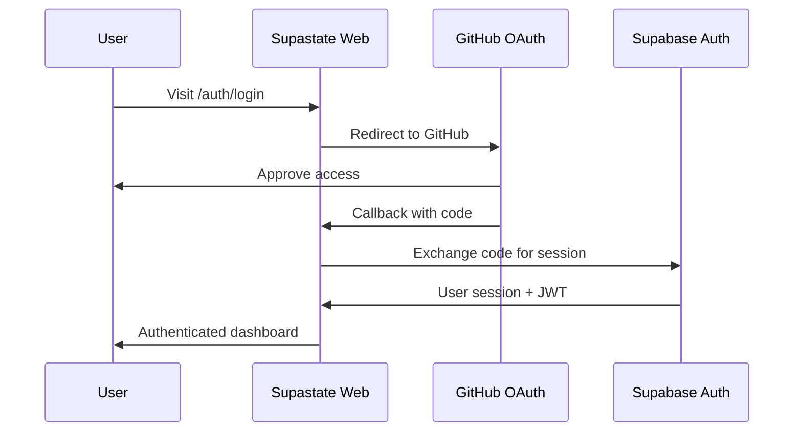
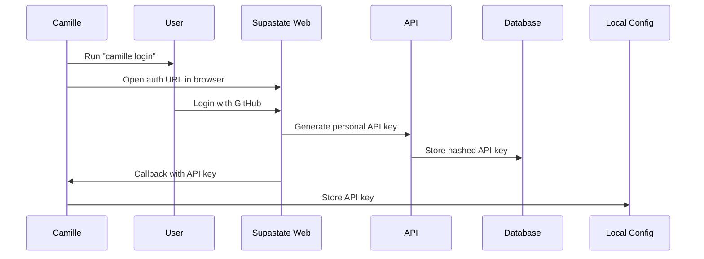
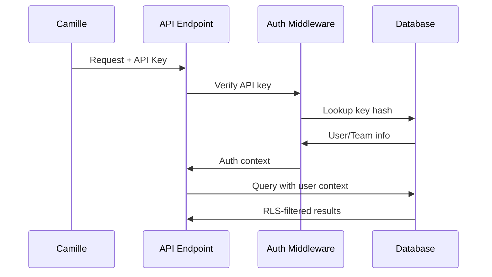

# Supastate Authentication & Data Flow Design

## Overview

Supastate is a multi-tenant, cloud-based service that stores and manages code intelligence data from multiple Camille instances. This document outlines the authentication mechanisms and data flow patterns.

## Key Requirements

1. **Multi-tenancy**: Support both team workspaces and personal workspaces
2. **Security**: Data isolation between users/teams with proper access control
3. **API Access**: Machine-to-machine authentication for Camille CLI
4. **Web Access**: Browser-based authentication for the Supastate dashboard
5. **Scalability**: Handle large amounts of embedding data (14GB+ per user)

## Authentication Flows

### 1. Web Dashboard Authentication (Human Users)



- Uses Supabase Auth with GitHub OAuth
- Creates user session with httpOnly cookies
- JWT contains user ID for RLS policies

### 2. Camille CLI Authentication (Machine-to-Machine)



- User authenticates via web browser
- System generates a personal API key
- API key is stored locally in Camille config
- All subsequent API calls use this key

### 3. API Request Authentication



## Data Architecture

### Database Access Patterns

1. **Web Dashboard**: Uses Supabase client with user JWT
   - Automatic RLS enforcement
   - Direct database queries with user context

2. **API Endpoints**: Two-tier approach
   - Public endpoints use service role for auth verification
   - Then create scoped queries with user context

### Row Level Security (RLS) Design

```sql
-- Memories table RLS
CREATE POLICY "memories_access" ON memories
USING (
  -- Personal workspace
  (user_id = auth.uid() OR user_id = current_setting('app.user_id')::uuid)
  OR
  -- Team workspace
  (team_id IN (
    SELECT team_id FROM team_members 
    WHERE user_id = auth.uid() OR user_id = current_setting('app.user_id')::uuid
  ))
);
```

Key points:
- Use `auth.uid()` for web sessions
- Use `current_setting('app.user_id')` for API key auth
- Service role sets the context before queries

## API Endpoint Implementation

### Memory Sync Endpoint

```typescript
// /api/memories/sync
export async function POST(request: NextRequest) {
  // 1. Extract API key
  const apiKey = request.headers.get('x-api-key')
  
  // 2. Verify API key using service client
  const { userId, teamId } = await verifyApiKey(apiKey)
  
  // 3. Create scoped client with user context
  const scopedClient = createScopedClient(userId)
  
  // 4. Perform operations with automatic RLS
  await scopedClient.from('memories').insert(data)
}
```

### Scoped Client Pattern

```typescript
function createScopedClient(userId: string) {
  // Use service client but set user context
  const client = createServiceClient()
  
  // Set user context for RLS
  client.rpc('set_user_context', { user_id: userId })
  
  return client
}
```

## Storage Considerations

### Large Embeddings Problem

- 3072-dimensional vectors = ~12KB per embedding
- Thousands of chunks per user = GBs of data
- pgvector has 2000 dimension limit for indexes

### Solutions

1. **Store but don't index**: Keep full embeddings, search via other means
2. **Hybrid search**: Use metadata/text search + load embeddings for reranking
3. **External vector store**: Use dedicated vector DB for similarity search
4. **Dimension reduction**: Store reduced embeddings for search, full for retrieval

## Security Considerations

1. **API Key Storage**
   - Never store plain text keys
   - Use SHA256 hashing
   - Show key only once on creation

2. **Rate Limiting**
   - Per-API key limits
   - Prevent abuse of sync endpoints

3. **Data Isolation**
   - RLS policies on all tables
   - No cross-tenant data leakage
   - Audit logs for access

## Implementation Plan

### Phase 1: Core Authentication
- [x] GitHub OAuth for web
- [ ] API key generation endpoint
- [ ] API key verification middleware
- [ ] Update RLS policies

### Phase 2: Personal Workspaces
- [x] Support user_id in all tables
- [ ] Personal API key management UI
- [ ] Camille login command

### Phase 3: Sync Infrastructure
- [ ] Batch sync endpoint with auth
- [ ] Progress tracking
- [ ] Conflict resolution

### Phase 4: Search & Retrieval
- [ ] Metadata-based search
- [ ] Hybrid search implementation
- [ ] Cross-workspace search (with permissions)

## Open Questions

1. Should we support multiple API keys per user?
2. How to handle API key rotation?
3. Should embeddings be encrypted at rest?
4. How to implement usage quotas/limits?
5. Should we use Edge Functions for compute-heavy operations?