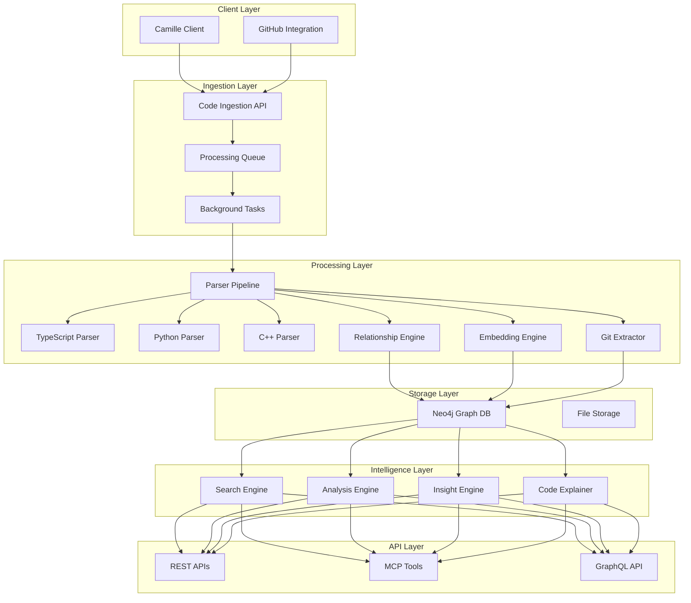

# Advanced Code Processing & Graph System Design
## Building a Next-Generation Code Intelligence Platform for Supastate

### Executive Summary

This document outlines the design for an advanced code processing system that transforms Supastate from a memory storage platform into a comprehensive code intelligence system. By leveraging Neo4j's graph capabilities, we will create deep relationships between code artifacts, memories, and developer knowledge, enabling unprecedented insights into software development patterns, knowledge evolution, and team collaboration.

### Vision & Goals

**Primary Vision**: Create the most advanced code understanding system that not only stores code but understands its meaning, evolution, relationships, and connection to developer conversations.

**Key Goals**:
1. **Deep Code Understanding**: Extract comprehensive code entities beyond basic functions/classes
2. **Rich Relationship Mapping**: Discover and maintain complex relationships between code, memories, and concepts
3. **Temporal Intelligence**: Track code evolution across commits, branches, and time
4. **Semantic Navigation**: Enable meaning-based code exploration, not just structural
5. **API-First Design**: Every capability exposed through APIs for LLM/MCP integration
6. **Real-time Processing**: Handle continuous code updates efficiently
7. **Multi-Language Support**: Start with TypeScript/JavaScript and Python, extensible to C++

### Architecture Overview



### Data Model

#### Core Node Types

```cypher
// 1. Code File Node
(:CodeFile {
  id: UUID,
  path: String,                    // Relative path from repo root
  absolute_path: String,           // Full file system path
  content: String,                 // Full file content
  language: String,                // Programming language
  size: Integer,                   // File size in bytes
  line_count: Integer,
  hash: String,                    // Content hash for change detection
  last_modified: DateTime,
  embedding: Float[3072],          // File-level embedding
  
  // Git metadata
  repo_url: String,
  repo_name: String,
  branch: String,
  commit_sha: String,
  
  // Ownership
  workspace_id: String,
  project_name: String
})

// 2. Enhanced Code Entity Types
(:Function {
  id: UUID,
  name: String,
  signature: String,               // Full function signature
  body: String,                    // Function body
  line_start: Integer,
  line_end: Integer,
  column_start: Integer,
  column_end: Integer,
  
  // Enhanced metadata
  parameters: JSON,                // [{name, type, optional, default}]
  return_type: String,
  is_async: Boolean,
  is_generator: Boolean,
  is_exported: Boolean,
  visibility: String,              // public/private/protected
  decorators: String[],            // Python decorators, TS decorators
  complexity: Integer,             // Cyclomatic complexity
  
  embedding: Float[3072],
  doc_embedding: Float[3072],      // Embedding of docstring/comments
  
  // Location
  file_id: UUID,
  project_name: String
})

(:Class {
  id: UUID,
  name: String,
  line_start: Integer,
  line_end: Integer,
  
  // Enhanced metadata
  is_abstract: Boolean,
  is_interface: Boolean,
  decorators: String[],
  generic_params: String[],        // TypeScript generics, C++ templates
  
  embedding: Float[3072],
  doc_embedding: Float[3072],
  
  file_id: UUID,
  project_name: String
})

(:Method {
  id: UUID,
  name: String,
  signature: String,
  body: String,
  line_start: Integer,
  line_end: Integer,
  
  // Method-specific
  is_constructor: Boolean,
  is_static: Boolean,
  is_abstract: Boolean,
  visibility: String,
  
  embedding: Float[3072],
  class_id: UUID,
  file_id: UUID
})

// 3. Additional Entity Types
(:TypeDefinition {
  id: UUID,
  name: String,
  definition: String,              // Full type definition
  kind: String,                    // type_alias, interface, enum
  line_start: Integer,
  exported: Boolean,
  
  embedding: Float[3072],
  file_id: UUID
})

(:Variable {
  id: UUID,
  name: String,
  kind: String,                    // const, let, var, global
  type: String,                    // Inferred or declared type
  value: String,                   // Initial value if const
  scope: String,                   // global, module, function, block
  line: Integer,
  
  file_id: UUID
})

(:Import {
  id: UUID,
  source: String,                  // Module being imported from
  imports: JSON,                   // What's being imported
  kind: String,                    // named, default, namespace, side-effect
  line: Integer,
  
  file_id: UUID
})

(:Comment {
  id: UUID,
  content: String,
  kind: String,                    // line, block, jsdoc, docstring
  line_start: Integer,
  line_end: Integer,
  
  embedding: Float[3072],          // For semantic search of comments
  file_id: UUID
})

(:JSXComponent {
  id: UUID,
  name: String,
  props: JSON,                     // Prop types/interface
  line_start: Integer,
  line_end: Integer,
  
  embedding: Float[3072],
  file_id: UUID
})

(:APIEndpoint {
  id: UUID,
  method: String,                  // GET, POST, etc.
  path: String,                    // /api/users/:id
  handler_function: UUID,          // Link to function
  middleware: String[],            // Applied middleware
  
  embedding: Float[3072],
  file_id: UUID
})

(:Hook {  // React hooks
  id: UUID,
  name: String,
  custom: Boolean,                 // Custom vs built-in
  dependencies: JSON,              // For useEffect, useMemo, etc.
  line_start: Integer,
  
  file_id: UUID,
  component_id: UUID
})

// 4. Git-related Nodes
(:Commit {
  id: UUID,
  sha: String,
  message: String,
  author: String,
  author_email: String,
  timestamp: DateTime,
  
  embedding: Float[3072],          // Embedding of commit message
  repo_url: String,
  branch: String
})

(:CodeVersion {
  id: UUID,
  entity_id: UUID,                 // ID of function/class/etc
  entity_type: String,
  content: String,                 // Version of the code
  commit_sha: String,
  timestamp: DateTime,
  
  embedding: Float[3072]
})

// 5. Analysis Nodes
(:SecurityIssue {
  id: UUID,
  type: String,                    // SQL injection, XSS, etc.
  severity: String,                // critical, high, medium, low
  description: String,
  line_start: Integer,
  line_end: Integer,
  
  file_id: UUID,
  function_id: UUID
})

(:CodePattern {
  id: UUID,
  name: String,                    // Singleton, Observer, etc.
  category: String,                // design_pattern, anti_pattern
  confidence: Float,
  
  embedding: Float[3072]
})

(:CodeExplanation {
  id: UUID,
  summary: String,                 // AI-generated explanation
  complexity_score: Integer,
  key_concepts: String[],
  generated_at: DateTime,
  
  entity_id: UUID,
  entity_type: String
})
```

#### Relationship Types

```cypher
// 1. Code Structure Relationships
(:Function)-[:DEFINED_IN]->(:CodeFile)
(:Class)-[:DEFINED_IN]->(:CodeFile)
(:Method)-[:BELONGS_TO]->(:Class)
(:Variable)-[:DECLARED_IN]->(:Function|:Method|:CodeFile)
(:Comment)-[:DOCUMENTS]->(:Function|:Class|:Method)
(:JSXComponent)-[:DEFINED_IN]->(:CodeFile)
(:Hook)-[:USED_IN]->(:JSXComponent|:Function)

// 2. Code Dependency Relationships
(:Function)-[:CALLS {line: Integer, context: String}]->(:Function)
(:Function)-[:INSTANTIATES {line: Integer}]->(:Class)
(:Class)-[:EXTENDS]->(:Class)
(:Class)-[:IMPLEMENTS]->(:TypeDefinition)
(:CodeFile)-[:IMPORTS {items: String[]}]->(:CodeFile)
(:Function)-[:USES_TYPE]->(:TypeDefinition)
(:JSXComponent)-[:RENDERS]->(:JSXComponent)
(:Function)-[:READS]->(:Variable)
(:Function)-[:WRITES]->(:Variable)

// 3. Memory-Code Relationships
(:Memory)-[:DISCUSSES {
  confidence: Float,
  context: String,
  extracted_by: String    // 'nlp', 'explicit', 'inferred'
}]->(:Function|:Class|:CodeFile)

(:Memory)-[:DEBUGS {
  error_type: String,
  resolved: Boolean
}]->(:Function)

(:Memory)-[:REFACTORS {
  before_content: String,
  after_content: String
}]->(:Function|:Class)

(:Memory)-[:IMPLEMENTS_FEATURE {
  feature_name: String
}]->(:Function|:Class|:CodeFile)

(:Memory)-[:DOCUMENTS]->(:Function|:Class)

(:Memory)-[:REVIEWS {
  sentiment: String,      // positive, negative, neutral
  suggestions: String[]
}]->(:CodeFile|:Function)

// 4. Temporal Relationships
(:CodeVersion)-[:VERSION_OF]->(:Function|:Class)
(:CodeVersion)-[:PRECEDED_BY]->(:CodeVersion)
(:Commit)-[:CONTAINS_CHANGE]->(:CodeVersion)
(:Commit)-[:PARENT_OF]->(:Commit)
(:Memory)-[:CREATED_DURING]->(:Commit)

// 5. Analysis Relationships
(:SecurityIssue)-[:FOUND_IN]->(:Function|:CodeFile)
(:SecurityIssue)-[:DISCUSSED_IN]->(:Memory)
(:Function)-[:IMPLEMENTS_PATTERN]->(:CodePattern)
(:CodeExplanation)-[:EXPLAINS]->(:Function|:Class|:CodeFile)

// 6. Project Relationships
(:CodeFile)-[:BELONGS_TO_PROJECT]->(:Project)
(:Memory)-[:REFERENCES_PROJECT]->(:Project)
(:Project)-[:DEPENDS_ON]->(:Project)

// 7. Cross-Entity Relationships
(:Function)-[:SIMILAR_TO {score: Float}]->(:Function)
(:Memory)-[:RELATED_TO {score: Float}]->(:Memory)
(:CodeFile)-[:RELATED_FILES {reason: String}]->(:CodeFile)
```

### Processing Pipeline

#### 1. Code Ingestion Flow

```typescript
// Edge Function: /supabase/functions/ingest-code/index.ts
interface CodeIngestionRequest {
  files: Array<{
    path: string
    content: string
    language: string
    lastModified: string
    gitMetadata?: {
      repoUrl: string
      branch: string
      commitSha: string
    }
  }>
  workspaceId: string
  projectName: string
  fullSync: boolean  // True for initial sync, false for incremental
}

async function ingestCode(req: CodeIngestionRequest) {
  // 1. Queue files for processing
  const taskId = crypto.randomUUID()
  
  // 2. Store files in processing queue
  await supabase.from('code_processing_queue').insert(
    req.files.map(file => ({
      id: crypto.randomUUID(),
      task_id: taskId,
      file_path: file.path,
      content: file.content,
      language: file.language,
      workspace_id: req.workspaceId,
      project_name: req.projectName,
      git_metadata: file.gitMetadata,
      status: 'pending',
      created_at: new Date().toISOString()
    }))
  )
  
  // 3. Start background processing
  runtime.waitUntil(processCodeBackground(taskId))
  
  return { taskId, filesQueued: req.files.length }
}
```

#### 2. Background Processing

```typescript
// Edge Function: /supabase/functions/process-code/index.ts
async function processCodeBackground(taskId: string) {
  const BATCH_SIZE = 50  // Smaller than memories due to complexity
  const PARALLEL_WORKERS = 10
  
  while (true) {
    // Get pending files
    const { data: files } = await supabase
      .from('code_processing_queue')
      .select('*')
      .eq('task_id', taskId)
      .eq('status', 'pending')
      .limit(BATCH_SIZE)
    
    if (!files || files.length === 0) break
    
    // Process in parallel
    const batches = chunk(files, PARALLEL_WORKERS)
    for (const batch of batches) {
      await Promise.all(
        batch.map(file => processCodeFile(file))
      )
    }
  }
}

async function processCodeFile(file: QueuedFile) {
  try {
    // 1. Parse code based on language
    const parser = getParser(file.language)
    const entities = await parser.parse(file.content)
    
    // 2. Generate embeddings for entities
    const embeddedEntities = await generateEmbeddings(entities)
    
    // 3. Extract relationships
    const relationships = await extractRelationships(entities, file)
    
    // 4. Store in Neo4j
    await storeInNeo4j(file, embeddedEntities, relationships)
    
    // 5. Analyze for patterns/issues
    await analyzeCode(file, entities)
    
    // 6. Auto-link to memories
    await linkToMemories(file, entities)
    
    // 7. Mark as completed
    await markCompleted(file.id)
    
  } catch (error) {
    await markFailed(file.id, error.message)
  }
}
```

#### 3. Language-Specific Parsers

```typescript
// TypeScript/JavaScript Parser
class TypeScriptParser implements CodeParser {
  async parse(content: string): Promise<CodeEntity[]> {
    const ast = ts.createSourceFile(
      'temp.ts',
      content,
      ts.ScriptTarget.Latest,
      true
    )
    
    const entities: CodeEntity[] = []
    
    // Enhanced visitor pattern
    const visit = (node: ts.Node) => {
      if (ts.isFunctionDeclaration(node)) {
        entities.push(extractFunction(node))
      } else if (ts.isClassDeclaration(node)) {
        entities.push(extractClass(node))
        // Extract methods, properties
        node.members.forEach(member => {
          if (ts.isMethodDeclaration(member)) {
            entities.push(extractMethod(member, node))
          }
        })
      } else if (ts.isInterfaceDeclaration(node)) {
        entities.push(extractInterface(node))
      } else if (ts.isTypeAliasDeclaration(node)) {
        entities.push(extractTypeAlias(node))
      } else if (ts.isImportDeclaration(node)) {
        entities.push(extractImport(node))
      } else if (ts.isJsxElement(node) || ts.isJsxSelfClosingElement(node)) {
        entities.push(extractJSXComponent(node))
      }
      // ... more entity types
      
      ts.forEachChild(node, visit)
    }
    
    visit(ast)
    return entities
  }
}

// Python Parser
class PythonParser implements CodeParser {
  async parse(content: string): Promise<CodeEntity[]> {
    // Use tree-sitter or Python AST module via subprocess
    const ast = await parsePythonAST(content)
    return extractPythonEntities(ast)
  }
}
```

#### 4. Relationship Extraction Engine

```typescript
class RelationshipEngine {
  async extractRelationships(
    entities: CodeEntity[],
    file: CodeFile,
    allFiles: Map<string, CodeFile>
  ): Promise<Relationship[]> {
    const relationships: Relationship[] = []
    
    for (const entity of entities) {
      // 1. Function calls
      if (entity.type === 'function') {
        const calls = extractFunctionCalls(entity.body)
        for (const call of calls) {
          const target = resolveCallTarget(call, entities, allFiles)
          if (target) {
            relationships.push({
              from: entity.id,
              to: target.id,
              type: 'CALLS',
              properties: {
                line: call.line,
                context: call.context
              }
            })
          }
        }
      }
      
      // 2. Inheritance
      if (entity.type === 'class' && entity.extends) {
        const parent = resolveClassReference(entity.extends, allFiles)
        if (parent) {
          relationships.push({
            from: entity.id,
            to: parent.id,
            type: 'EXTENDS'
          })
        }
      }
      
      // 3. Type usage
      const typeRefs = extractTypeReferences(entity)
      for (const typeRef of typeRefs) {
        const typeDef = resolveTypeReference(typeRef, entities, allFiles)
        if (typeDef) {
          relationships.push({
            from: entity.id,
            to: typeDef.id,
            type: 'USES_TYPE'
          })
        }
      }
      
      // 4. Variable access
      const varAccess = extractVariableAccess(entity)
      for (const access of varAccess) {
        relationships.push({
          from: entity.id,
          to: access.varId,
          type: access.isWrite ? 'WRITES' : 'READS',
          properties: { line: access.line }
        })
      }
    }
    
    return relationships
  }
  
  // Handle forward references
  async resolveForwardReferences(projectId: string) {
    // Query Neo4j for unresolved references
    const query = `
      MATCH (f:Function|Class|TypeDefinition)
      WHERE f.project_name = $projectId 
        AND f.has_unresolved_refs = true
      RETURN f
    `
    
    // Attempt to resolve now that more files are processed
    // Update relationships accordingly
  }
}
```

#### 5. Embedding Generation

```typescript
async function generateEmbeddings(entities: CodeEntity[]): Promise<CodeEntity[]> {
  const BATCH_SIZE = 50  // OpenAI batch limit
  
  for (const batch of chunk(entities, BATCH_SIZE)) {
    // Generate embeddings for code content
    const codeInputs = batch.map(e => {
      // Intelligent context for embedding
      return `${e.type}: ${e.name}\n${e.signature || ''}\n${truncate(e.body, 4000)}`
    })
    
    const codeEmbeddings = await openai.embeddings.create({
      model: 'text-embedding-3-large',
      input: codeInputs,
      dimensions: 3072
    })
    
    // Generate embeddings for documentation
    const docInputs = batch.map(e => e.documentation || e.comments || '')
      .filter(doc => doc.length > 0)
    
    const docEmbeddings = docInputs.length > 0 
      ? await openai.embeddings.create({
          model: 'text-embedding-3-large',
          input: docInputs,
          dimensions: 3072
        })
      : null
    
    // Assign embeddings
    batch.forEach((entity, i) => {
      entity.embedding = codeEmbeddings.data[i].embedding
      if (docEmbeddings && entity.documentation) {
        entity.docEmbedding = docEmbeddings.data[i].embedding
      }
    })
  }
  
  return entities
}
```

#### 6. Memory-Code Linking

```typescript
class MemoryCodeLinker {
  async linkToMemories(file: CodeFile, entities: CodeEntity[]) {
    // 1. Find memories that might reference this code
    const recentMemories = await neo4j.query(`
      MATCH (m:Memory)
      WHERE m.project_name = $projectName
        AND m.created_at > datetime() - duration('P30D')
      RETURN m
    `, { projectName: file.project_name })
    
    for (const memory of recentMemories) {
      // 2. NLP extraction of code references
      const codeRefs = await extractCodeReferences(memory.content)
      
      for (const ref of codeRefs) {
        // 3. Try to match with entities
        const matches = findMatchingEntities(ref, entities)
        
        for (const match of matches) {
          await neo4j.query(`
            MATCH (m:Memory {id: $memoryId})
            MATCH (e:${match.type} {id: $entityId})
            MERGE (m)-[r:DISCUSSES {
              confidence: $confidence,
              context: $context,
              extracted_by: 'nlp'
            }]->(e)
          `, {
            memoryId: memory.id,
            entityId: match.id,
            confidence: match.confidence,
            context: ref.context
          })
        }
      }
      
      // 4. Semantic similarity matching
      const semanticMatches = await findSemanticMatches(
        memory.embedding,
        entities
      )
      
      for (const match of semanticMatches) {
        if (match.score > 0.85) {
          await createRelationship(memory, match.entity, 'DISCUSSES')
        }
      }
    }
  }
  
  async extractCodeReferences(text: string): Promise<CodeReference[]> {
    // Use NLP to extract potential code references
    const patterns = [
      /\b(\w+Service)\b/g,              // Service classes
      /\b(\w+Controller)\b/g,           // Controllers
      /\bfunction\s+(\w+)/g,            // Function mentions
      /\bclass\s+(\w+)/g,               // Class mentions
      /`([^`]+)`/g,                     // Code in backticks
      /\b(\w+\.\w+)\(/g,                // Method calls
    ]
    
    const refs: CodeReference[] = []
    
    for (const pattern of patterns) {
      const matches = text.matchAll(pattern)
      for (const match of matches) {
        refs.push({
          text: match[1],
          context: extractContext(text, match.index),
          type: inferType(match[0])
        })
      }
    }
    
    return refs
  }
}
```

#### 7. Code Analysis & Security

```typescript
class CodeAnalyzer {
  async analyzeCode(file: CodeFile, entities: CodeEntity[]) {
    // 1. Security analysis
    await this.securityAnalysis(file, entities)
    
    // 2. Code patterns detection
    await this.detectPatterns(entities)
    
    // 3. Complexity analysis
    await this.complexityAnalysis(entities)
    
    // 4. Generate AI explanations
    await this.generateExplanations(entities)
  }
  
  async securityAnalysis(file: CodeFile, entities: CodeEntity[]) {
    const vulnerabilities = []
    
    for (const entity of entities) {
      if (entity.type === 'function') {
        // SQL Injection
        if (entity.body.includes('query') && 
            entity.body.match(/\$\{[^}]+\}|" \+ .+ \+ "/)) {
          vulnerabilities.push({
            type: 'SQL_INJECTION',
            severity: 'high',
            entity_id: entity.id,
            line: entity.line_start,
            description: 'Potential SQL injection vulnerability'
          })
        }
        
        // XSS
        if (entity.body.includes('innerHTML') ||
            entity.body.includes('dangerouslySetInnerHTML')) {
          vulnerabilities.push({
            type: 'XSS',
            severity: 'medium',
            entity_id: entity.id,
            line: entity.line_start,
            description: 'Potential XSS vulnerability'
          })
        }
        
        // More security checks...
      }
    }
    
    // Store vulnerabilities in Neo4j
    for (const vuln of vulnerabilities) {
      await neo4j.query(`
        CREATE (v:SecurityIssue {
          id: randomUUID(),
          type: $type,
          severity: $severity,
          description: $description,
          line_start: $line,
          file_id: $fileId,
          function_id: $functionId
        })
        WITH v
        MATCH (f:Function {id: $functionId})
        CREATE (v)-[:FOUND_IN]->(f)
      `, vuln)
    }
  }
  
  async generateExplanations(entities: CodeEntity[]) {
    // Generate AI explanations for complex code
    const complexEntities = entities.filter(e => 
      e.complexity > 10 || e.line_count > 50
    )
    
    for (const entity of complexEntities) {
      const explanation = await generateAIExplanation(entity)
      
      await neo4j.query(`
        CREATE (e:CodeExplanation {
          id: randomUUID(),
          summary: $summary,
          complexity_score: $complexity,
          key_concepts: $concepts,
          generated_at: datetime(),
          entity_id: $entityId,
          entity_type: $entityType
        })
        WITH e
        MATCH (entity {id: $entityId})
        CREATE (e)-[:EXPLAINS]->(entity)
      `, {
        summary: explanation.summary,
        complexity: entity.complexity,
        concepts: explanation.keyConcepts,
        entityId: entity.id,
        entityType: entity.type
      })
    }
  }
}
```

### API Design

#### 1. REST APIs

```typescript
// Search API
POST /api/code/search
{
  query: string,              // Text or code snippet
  mode: 'semantic' | 'structural' | 'hybrid',
  filters: {
    language?: string[],
    project?: string,
    filePattern?: string,
    entityType?: string[],
    dateRange?: { from: Date, to: Date }
  },
  includeRelated: {
    memories: boolean,
    similar: boolean,
    dependencies: boolean,
    versions: boolean
  },
  limit: number
}

// Code explanation API
POST /api/code/explain
{
  entityId: string,
  level: 'brief' | 'detailed' | 'eli5',
  includeContext: boolean
}

// Relationship discovery API
GET /api/code/relationships/:entityId
{
  types: string[],           // Relationship types to include
  depth: number,             // How many hops
  direction: 'in' | 'out' | 'both'
}

// Code evolution API
GET /api/code/evolution/:entityId
{
  timeRange?: { from: Date, to: Date },
  includeCommits: boolean,
  includeDiffs: boolean
}

// Security analysis API
GET /api/code/security/:projectId
{
  severity?: string[],
  includeFixed: boolean,
  includeDiscussions: boolean
}
```

#### 2. GraphQL API

```graphql
type Query {
  # Search for code entities
  searchCode(
    query: String!
    mode: SearchMode!
    filters: CodeFilters
    first: Int = 20
  ): CodeSearchResult!
  
  # Get code entity with relationships
  codeEntity(id: ID!): CodeEntity
  
  # Find code-memory connections
  codeMemoryGraph(
    codeId: ID
    memoryId: ID
    depth: Int = 2
  ): KnowledgeGraph!
  
  # Get project code insights
  projectInsights(
    projectId: ID!
    timeRange: TimeRange
  ): ProjectInsights!
}

type CodeEntity {
  id: ID!
  name: String!
  type: EntityType!
  content: String!
  file: CodeFile!
  
  # Relationships
  calls: [Function!]
  calledBy: [Function!]
  dependencies: [CodeEntity!]
  memories(first: Int): [Memory!]
  versions: [CodeVersion!]
  explanations: [CodeExplanation!]
  securityIssues: [SecurityIssue!]
  
  # Computed fields
  complexity: Int!
  lastModified: DateTime!
  discussionCount: Int!
}

type KnowledgeGraph {
  nodes: [GraphNode!]!
  edges: [GraphEdge!]!
  insights: [Insight!]!
}
```

#### 3. MCP Tools

```typescript
// Code search tool for LLMs
{
  name: "search_project_code",
  description: "Search code in a project using semantic or structural queries",
  parameters: {
    query: "string - natural language or code pattern",
    project: "string - project name",
    includeExplanations: "boolean - include AI explanations"
  }
}

// Code explanation tool
{
  name: "explain_code",
  description: "Get AI-generated explanation of code functionality",
  parameters: {
    filePath: "string - path to file",
    functionName: "string - specific function to explain",
    level: "string - brief|detailed|eli5"
  }
}

// Find related memories tool
{
  name: "find_code_discussions",
  description: "Find all memories/discussions about specific code",
  parameters: {
    codeReference: "string - function/class/file name",
    timeRange: "string - last_week|last_month|all"
  }
}

// Security check tool
{
  name: "check_code_security",
  description: "Analyze code for security vulnerabilities",
  parameters: {
    filePath: "string - file to analyze",
    includeFixed: "boolean - include already fixed issues"
  }
}
```

### UI Components

#### 1. Code Graph Visualization

```typescript
// Interactive 3D graph using react-force-graph
interface CodeGraphProps {
  centerEntity: string      // Entity ID to center on
  depth: number            // Relationship depth
  filters: {
    relationshipTypes: string[]
    entityTypes: string[]
    showMemories: boolean
    showVersions: boolean
  }
}

// Features:
// - Zoom to node on click
// - Expand/collapse node relationships
// - Color coding by entity type
// - Edge labels for relationship types
// - Timeline slider for version history
// - Memory nodes shown as different shape
```

#### 2. Code Browser with Memory Integration

```typescript
// Monaco-based code viewer with enhancements
interface CodeBrowserProps {
  file: CodeFile
  highlights: Array<{
    start: number
    end: number
    type: 'memory' | 'security' | 'pattern'
    data: any
  }>
  splitPane: {
    show: boolean
    content: 'memories' | 'graph' | 'explanation'
  }
}

// Features:
// - Inline memory indicators
// - Hover for related discussions
// - Security issue highlighting
// - Click to show explanation
// - Side panel for memories/graph
```

#### 3. Advanced Search Interface

```typescript
// Multi-modal search with facets
interface CodeSearchProps {
  initialQuery?: string
  mode: 'semantic' | 'structural' | 'hybrid'
  
  // Results grouped by type
  results: {
    files: CodeFile[]
    functions: Function[]
    classes: Class[]
    memories: Memory[]
  }
  
  // Faceted filtering
  facets: {
    language: Record<string, number>
    project: Record<string, number>
    author: Record<string, number>
    dateRange: DateHistogram
  }
}
```

#### 4. Knowledge Evolution Timeline

```typescript
// Visual timeline of code and memory evolution
interface EvolutionTimelineProps {
  entity: CodeEntity
  timeRange: DateRange
  
  // Events on timeline
  events: Array<{
    type: 'commit' | 'memory' | 'refactor' | 'bug_fix'
    timestamp: Date
    data: any
  }>
}

// Features:
// - Zoomable timeline
// - Event clustering
// - Diff view on hover
// - Memory previews
// - Branch visualization
```

### Optimizations & Performance

#### 1. Incremental Processing

```typescript
class IncrementalProcessor {
  async processFileChange(file: CodeFile) {
    // 1. Compute diff
    const oldVersion = await getLastVersion(file.path)
    const diff = computeDiff(oldVersion, file.content)
    
    // 2. Find affected entities
    const affectedEntities = findAffectedEntities(diff)
    
    // 3. Update only changed entities
    for (const entity of affectedEntities) {
      // Update entity
      await updateEntity(entity)
      
      // Update relationships
      await updateRelationships(entity)
      
      // Re-generate embeddings if needed
      if (entity.contentChanged) {
        await generateEmbedding(entity)
      }
    }
    
    // 4. Update file metadata
    await updateFileMetadata(file)
  }
}
```

#### 2. Neo4j Query Optimization

```cypher
// Optimized indexes
CREATE INDEX entity_project_type IF NOT EXISTS
FOR (n:Function|Class|Method) ON (n.project_name, n.type)

CREATE INDEX file_project_path IF NOT EXISTS  
FOR (f:CodeFile) ON (f.project_name, f.path)

CREATE INDEX memory_project_date IF NOT EXISTS
FOR (m:Memory) ON (m.project_name, m.created_at)

// Full-text search indexes
CREATE FULLTEXT INDEX entity_name_search IF NOT EXISTS
FOR (n:Function|Class|Method|TypeDefinition) ON EACH [n.name]

CREATE FULLTEXT INDEX code_content_search IF NOT EXISTS
FOR (n:Function|Class) ON EACH [n.body]

// Vector indexes with optimization
CREATE VECTOR INDEX entity_embeddings IF NOT EXISTS
FOR (n:Function|Class|Method) ON n.embedding
OPTIONS {
  indexConfig: {
    `vector.dimensions`: 3072,
    `vector.similarity_function`: 'cosine',
    `vector.hnsw.m`: 16,
    `vector.hnsw.ef_construction`: 200
  }
}
```

#### 3. Caching Strategy

```typescript
// Multi-level caching
class CodeCache {
  // In-memory cache for hot paths
  private memoryCache = new LRU<string, any>({ max: 1000 })
  
  // Redis for distributed cache
  private redis: Redis
  
  // Neo4j query result cache
  async getCachedQuery(query: string, params: any) {
    const key = hash(query + JSON.stringify(params))
    
    // Check memory cache
    if (this.memoryCache.has(key)) {
      return this.memoryCache.get(key)
    }
    
    // Check Redis
    const cached = await this.redis.get(key)
    if (cached) {
      const result = JSON.parse(cached)
      this.memoryCache.set(key, result)
      return result
    }
    
    return null
  }
  
  // Invalidation strategy
  async invalidateEntity(entityId: string) {
    // Find all cached queries referencing this entity
    const pattern = `*${entityId}*`
    const keys = await this.redis.keys(pattern)
    await this.redis.del(...keys)
  }
}
```

### Monitoring & Analytics

```typescript
// Key metrics to track
interface CodeProcessingMetrics {
  // Processing performance
  filesProcessedPerMinute: number
  avgProcessingTime: number
  embeddingGenerationTime: number
  
  // Graph statistics  
  totalEntities: Record<string, number>
  totalRelationships: Record<string, number>
  avgRelationshipsPerEntity: number
  
  // Search performance
  searchLatency: { p50: number, p95: number, p99: number }
  cacheHitRate: number
  
  // Quality metrics
  unresolvedReferences: number
  securityIssuesFound: number
  codeExplanationsGenerated: number
  
  // Usage analytics
  topSearchQueries: Array<{ query: string, count: number }>
  mostViewedEntities: Array<{ id: string, views: number }>
  apiUsage: Record<string, number>
}
```

### Migration Plan

#### Phase 1: Foundation (Week 1)
1. Set up code ingestion API endpoint
2. Implement TypeScript/JavaScript parser
3. Create Neo4j schema for code entities
4. Build basic embedding generation
5. Implement file change detection in Camille

#### Phase 2: Core Processing (Week 2)
1. Build relationship extraction engine
2. Implement Python parser
3. Create memory-code linking system
4. Add security analysis
5. Build incremental processing

#### Phase 3: Intelligence Layer (Week 3)
1. Implement code explanation generation
2. Build pattern detection
3. Create Git integration
4. Add version tracking
5. Implement advanced search

#### Phase 4: UI & API (Week 4)
1. Build code graph visualization
2. Create code browser component
3. Implement search UI
4. Build REST & GraphQL APIs
5. Add MCP tool implementations

#### Phase 5: Optimization & Polish (Week 5)
1. Performance optimization
2. Caching implementation
3. Monitoring setup
4. Documentation
5. Testing & bug fixes

### Summary

This design creates a revolutionary code intelligence system that:

1. **Deeply understands code** - Not just storing files but understanding every entity, relationship, and meaning
2. **Connects code to knowledge** - Links code with developer discussions, decisions, and learning
3. **Tracks evolution** - Understands how code changes over time and why
4. **Provides intelligence** - AI-powered explanations, security analysis, and pattern detection
5. **Enables powerful search** - Semantic, structural, and hybrid search capabilities
6. **Scales efficiently** - Incremental processing, intelligent caching, and optimized queries
7. **Integrates seamlessly** - API-first design for LLM/MCP integration

The system will transform how developers interact with their code, providing unprecedented insights into not just what the code does, but why it exists, how it evolved, and what knowledge surrounds it.